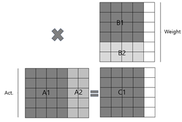

# MATRIX-MULTIPLIER with Systolic Array

이 저장소는 **행렬 곱 연산**을 가속화하기 위해 설계한 **Systolic Array 기반 하드웨어 구조**를 담고 있습니다.  
특히 **Weight Stationary 기법**, **Reverse-order 전송 방식**, **Tiling 기반 행렬 곱셈** 등을 적용하여 효율적이고 끊김 없는 연산을 지원합니다.  

---

## 🚀 주요 기능

- 행렬 곱 연산
- Weight Stationary Systolic Array 기반의 PE 구조
- Reverse-order 기법을 통한 Weight 갱신 시 연산 끊김 방지
- Tiling 기법으로 대규모 행렬 연산 처리 가능

---

## 🧩 시스템 구조

### 1. Processing Element (PE)

PE 내부 구조:  
- LRF(Local Register File)에 Weight 저장  
- MAC(Multiply–Accumulate) 연산 수행  
- Partial SUM(PSUM)을 다음 PE로 전달  

  
*Fig. 2. Processing Element (PE) 구조*

---

### 2. 4×4 Systolic Array

설계한 PE를 이용해 구성한 4×4 Systolic Array 구조.  

  
*Fig. 3. 4×4 Systolic Array 구조*

---

### 3. Reverse-order 기법

Weight에서 w0 -> w1 -> w2 -> w3 순서로 전달하는 방식이 아니라 반대인 w3 -> w2 -> w1 -> w0 순서로 전달하는 방식
이를 이용해 새로운 Weight를 Load 할 경우에도 끊기지 않고 연속적인 계산이 가능. 

---

### 4. Tiling 기반 행렬 곱셈

입력 이미지 크기가 큰 경우 커널 크기 단위로 Tiling을 적용하여 파이프라인이 끊기지 않고 연산이 수행됨.  

  
*Fig. 4. Tiling 기반 행렬 곱셈*

---

## ⚙️ 사용 방법

1. `pe.v`, `systolic_array.v`, `tiling.v`를 프로젝트에 포함.
2. `clk`과 `rst` 신호는 **사용자가 별도로 연결**해야 함.

---

## 📖 References

- 주진원. *Depthwise Convolution의 Utilization 향상을 위한 열 방향 가중치 겹침을 적용한 Systolic Array*.  
  석사학위논문, 한양대학교, 2022.  